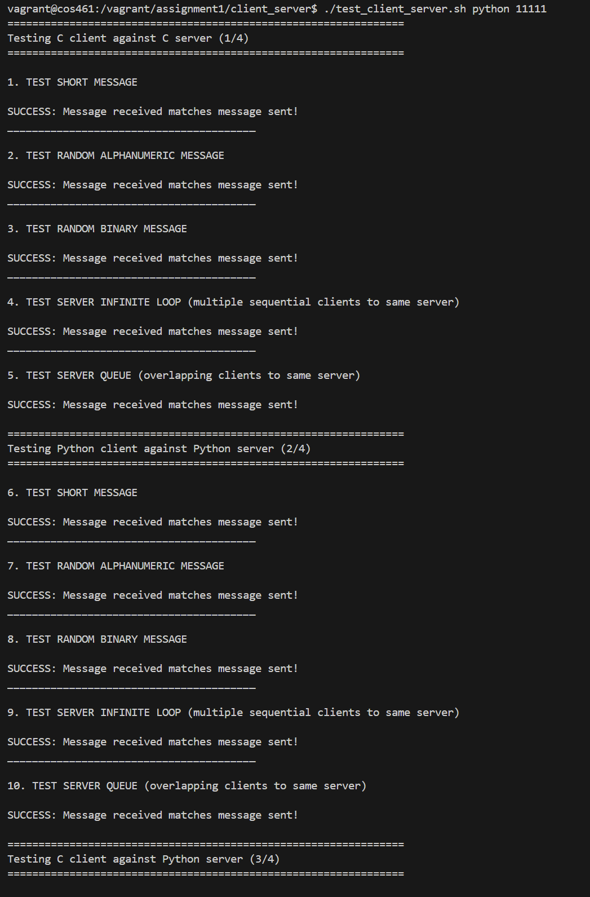
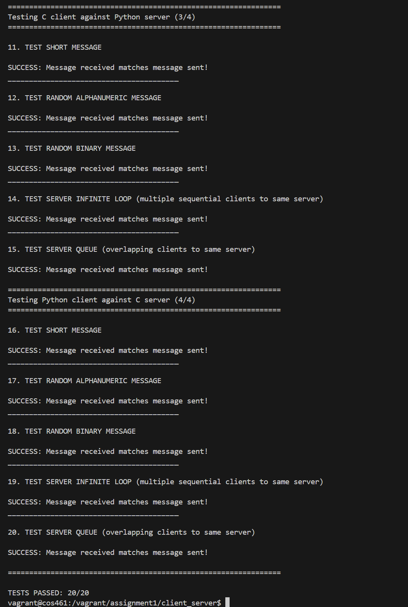

## 实验报告  
---  

### 关键代码解释  
---  
#### TCP通信的流程
```
server                                      client
   |                                           |
   V                                           V
socket()                                    socket()
   |                                           |
   V                                           |
setsocketopt() 设置端口复用                     |
   |                                           |
   V                                           V
bind()                                      connect()
   |                                           |
   V                                           |
listen()                                       |
   |                                           |
   V                                           |
accept()                                       |
   |                                           |
   V                                           V
recv()                                      send()
   |                                           |
   V                                           V
close()                                     close()

```
#### recv和send的细节
```
┌─────────────────┐                 ┌─────────────────┐
│  Client 进程    │                 │  Server 进程     │
│  (send 调用者)  │                 │  (recv 调用者)   │
└─────────────────┘                 └─────────────────┘
        │                                      ▲
        │ 1. fread() 将数据读入用户缓冲          │
        ▼                                      │
┌─────────────────┐                 ┌─────────────────┐
│  用户缓冲区      │ --2. send()-->  │  内核发送缓冲    │
│  (user space)   │   复制/阻塞处理  │  (kernel space) │
└─────────────────┘                 └─────────────────┘
                                           │
        ←←←←←←←←←←← 3. TCP 封装、分段、重传 …… →→→→→→→→→→→
                                           │
┌─────────────────┐                 ┌─────────────────┐
│  用户缓冲区      │ <--4. recv()--  │  内核接收缓冲    │
│  (user space)   │   逐块复制       │  (kernel space) │
└─────────────────┘                 └─────────────────┘
        ▲                                      │
        │ 5. fwrite() / 逻辑处理                │
        └──────────────────────────────────────┘
```

关键节点说明：
 `recv` `send` 从“内核接收缓冲”取出当前可用字节，可能一次拿不满，需要循环读取。

```c
/* server-c.c中与recv缓冲区读取相关的代码*/
 ssize_t n;
    while ((n = recv(connfd, buf, sizeof buf, 0)) > 0) {
      size_t off = 0; // 2048*n
      while (off < (size_t)n) {
        size_t w = fwrite(buf + off, 1, (size_t)n - off, stdout);
        if (w == 0 && ferror(stdout)) { 
          perror("fwrite"); 
          break; 
        }
        off += w;
      }
      fflush(stdout);
    }
```
- recv参数解释：connfd套接字文件描述符，buf缓冲地址
- 超出缓冲块规定大小的读取逻辑：通过参数off(offset)来循环读取之后的地址处的信息。

```c
/* client-c.c中与send缓冲区发送相关的代码*/
  size_t nread;
  while ((nread = fread(buf, 1, sizeof buf, stdin)) > 0) {
    size_t total = 0;
    while (total < nread) {
      ssize_t sent = send(sockfd, buf + total, nread - total, 0);
      if (sent == -1) { 
        perror("send"); 
        close(sockfd); 
        freeaddrinfo(res); 
        return 1; 
      }
      total += (size_t)sent;
    }
  }
```
- send的逻辑与recv逻辑正好相同，不同点就是从输出到stdout变成从stdin读取。

#### addrinfo结构体

>总的来说，从本实验考虑（TCP通信、本机ip），sockaddr涉及一些大小端转换的代码，相对繁琐，而且仅支持ipv4协议，故采用addrinfo结构体，相对泛用而且简便。

- 定义
```c
struct addrinfo {
    int              ai_flags;      // 标志位（如 AI_PASSIVE，AI_CANONNAME）
    int              ai_family;     // 协议族（AF_INET, AF_INET6, AF_UNSPEC等）
    int              ai_socktype;   // 套接字类型（SOCK_STREAM, SOCK_DGRAM等）
    int              ai_protocol;   // 协议（通常是0，表示自动选择）
    socklen_t        ai_addrlen;    // 地址长度
    struct sockaddr *ai_addr;       // 指向实际地址结构体（如sockaddr_in）
    char            *ai_canonname;  // 主机规范名称（通常用于域名解析）
    struct addrinfo *ai_next;       // 链表下一个元素
};
```
- 代码中应用
```c
struct addrinfo hints, *res, *p;
memset(&hints, 0, sizeof hints);
hints.ai_family = AF_INET;
hints.ai_socktype = SOCK_STREAM;
hints.ai_flags = AI_PASSIVE;

getaddrinfo(NULL, server_port, &hints, &res);
```
`hints` 作用  
- `AF_INET`：只要 IPv4 地址
- `SOCK_STREAM`：TCP 类型
- `AI_PASSIVE`：服务器用，地址可以用于 bind（监听）

#### C 语言实现
- **`client-c.c`**
    - `getaddrinfo`：根据用户输入的服务器 IP 和端口解析出地址结构，屏蔽了 IPv4/IPv6 差异。
    - `socket` + `connect`：创建 TCP 套接字并主动建立连接，若失败打印错误码并终止。
    - 读取 stdin：使用 `fread`/`fgets` 将标准输入的数据分块读入缓冲区，再通过循环 `send` 保证全部字节都写入到 TCP 流中。
    - 错误处理：每一步都检查返回值并通过 `perror` 输出具体原因，保证遇到异常时能快速定位问题。

- **`server-c.c`**
    - `getaddrinfo` + `bind` + `listen`：结合 `AI_PASSIVE` 旗标绑定本地地址，并用 `SO_REUSEADDR` 选项避免端口被 TIME_WAIT 占用导致的重启失败。
    - `accept` 循环：主循环中不断接受新的客户端连接，保证服务器可无限提供服务。
    - `recv` + `fwrite`：接收到的二进制数据直接写到标准输出，使用内部 `off` 指针确保即使 `fwrite` 只写入部分数据也能继续补齐余量。
    - 资源释放：对出错的连接使用 `continue`，避免单一客户端故障影响整个服务，循环尾部关闭 `connfd`。

#### Python 实现
- **`client-python.py`**
    - `socket.socket(AF_INET, SOCK_STREAM)` 创建 TCP 套接字，`connect` 建立连接。
    - 使用 `sys.stdin.buffer.read` 逐块读取二进制输入，`sendall` 保证一块数据在发送完成前不会返回。
    - 完成后显式 `close`，触发 TCP 四次挥手释放资源。

- **`server-python.py`**
    - `setsockopt(SO_REUSEADDR)` 与 C 版本保持一致，实现快速复用端口。
    - `accept` 用上下文管理 (`with conn`) 自动关闭连接。
    - `sys.stdout.buffer.write` 直接写入标准输出，保持原始字节流不被编码器修改，同时 `flush` 保证结果及时刷新到重定向文件。

### 实验结果截图和分析   
---  
展示如下代码调用的结果  
```bash 
./test_client_server.sh python 11111
```  
- **图 1（`pictures/image1.png`）**  
  
- **图 2（`pictures/image2.png`）**  
 